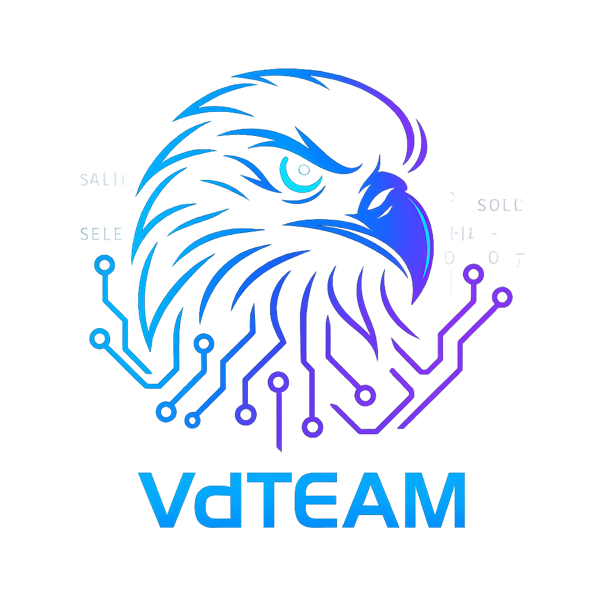

<div align="center">
  
  
  <h1 align="center" style="font-family:monospace;font-size:2.5em;margin-bottom:0;background: linear-gradient(90deg, #00f0ff, #ff00cc); -webkit-background-clip: text; color: transparent;">
    Hi, I'm Mohammad Ahmadi
  </h1>
  <p style="color: #999; font-size: 1.2em; font-family: monospace;">
    aka <strong>Movi</strong> | System Engineer • AI Enthusiast • DevOps Explorer
  </p>
</div>

---


## 🧠 About Me

- 🧬 Nickname: **Movi** — "M" from *Mohammad* + "Ovi" (from *Oviraptor*, a fast, observant dinosaur 🦖 — like code should be)
- 🕹 Passionate about **CS:GO** — strategic gameplay and fast decision-making influence how I code and debug.
- 🧩 First Programming Language: `Pawn` (SAMP modding) — started as a translator, later built automation tools.
- 🌐 From there: `WordPress` → `PHP` → and fully professional in `C#` during the last 3 years.
- 🎯 Career Path:
  - 🔄 First step: Become a **Scrum Master** — team orchestration, Agile delivery & planning.
  - 🧠 Long-term: Dive into **Artificial Intelligence**, focusing on automation, smart systems & optimization.
- ⚙️ Passionate about DevOps, learning CI/CD automation, infrastructure-as-code & GitHub Actions.
- 🔬 Exploring: OS Development, Reverse Engineering, Virtualization
- 💻 Languages: `C#`, `C++`, `Python`, `Assembly (x86)`
- 🌐 Frameworks: `ASP.NET Core`, `WinForms`, `Blazor`
- 🐳 Tools: `Docker`, `SQL Server`, `Git`, `GitHub Actions`
- 📚 Learning: OS internals, compiler design, structured logging

---

## 🚀 Featured Projects

### 🔷 [VDOS](https://github.com/MohammadMovi/VDOS)
> Virtual OS simulator using custom bytecode engine — built for learning low-level computing.

---

## 🛠 Tech Toolbox

```txt
Languages:    C#, C++, Python, Assembly (x86)
Frameworks:   ASP.NET Core, WinForms, Blazor
DevOps:       Docker, GitHub Actions, CI/CD
Database:     SQL Server, T-SQL
Concepts:     OS Internals, Memory, Virtualization
```

---

## 📊 GitHub Stats

<p align="center">
  
  <br>
  
</p>

---

## 🌐 Personal & Academic Projects

🚀 Two powerful platforms under construction:

### **🎯 [vanguarddevelopers.ir](http://vanguarddevelopers.ir)**  
Personal DevOps-driven landing page & portfolio — will showcase Mohammad's core engineering stack, products, CI/CD pipelines, and professional brand.

### **📘 [vdteam.ir](http://vdteam.ir)**  
Academic platform for high-performance programming topics:
- 🧪 **.NET Benchmarking** (e.g., Dapper vs EF Core)
- 📦 **TVP** in SQL Server
- ♻️ **Object Pooling and GC** usage in C#, Python, and more
- 🔍 Logging strategies & structured tracing
- 🧠 Architecture patterns and real-world refactoring techniques

🎓 **vdteam.ir** bridges theory with deep production experience — developed by professionals, for professionals.

---

## 📫 Let's Connect

- 🌍 Website: [vanguarddevelopers.ir](http://vanguarddevelopers.ir)
- 💼 LinkedIn: [linkedin.com/in/mohammad-ahmadi-12a709166](https://www.linkedin.com/in/mohammad-ahmadi-12a709166/)
- 🐙 GitHub: [@MohammadMovi](https://github.com/MohammadMovi)
- 📸 Instagram: [@mohammadahmadi](https://www.instagram.com/mohammadahmadi/)

---

<div align="center">
  <strong><em style="color:#39FF14;font-family:monospace;font-size:1.2em;">
    "Real Code. Real Bugs. Real Experience."
  </em></strong>
  <br/>
  <sub style="color:#888;">— Member of <strong> VDTeam</strong> since 2017</sub>
</div>
